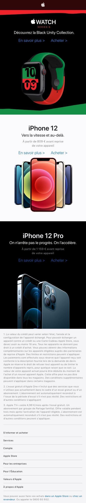

# css-apple-mobile

> CSS exercise given at HEPL

* * *

**CSS "Apple Mobile"** is an educational project, which will be used for `HTML`/`CSS` courses.

**Note:** the school where the course is given, the [HEPL](http://www.provincedeliege.be/hauteecole) from Liège, Belgium, is a french-speaking school. From this point, the instruction will be in french. Sorry.

* * *

Exercice d'intégration de la page d'acceuil du site mobile d'Apple en 2020

### Consignes

* Créer et lier le fichier **styles.css** à la page **index.html**.
* Utiliser un reset, celui d'[Eric Meyer](https://meyerweb.com/eric/tools/css/reset/) par exemple.
* En vous fiant aux rendus attendus du fichier Adobe XD, compléter la feuille de styles.
* Toutes les images à utiliser se trouvent dans le dossier **img**.
* Une fois l'exercice terminé, n'hésitez pas à **corriger votre code** à l'aide de la solution disponible sur cette page via le bouton **main** en haut à gauche. Cliquez ensuite sur *completed*, cela rechargera la page en y ajoutant la solution.
* Bon travail et bon amusement&nbsp;!

### Outils

- [Comment masquer un élément visuellement ?](https://css-tricks.com/places-its-tempting-to-use-display-none-but-dont/)
- [Comment importer une typo avec @font-face ?](https://developer.mozilla.org/fr/docs/Web/CSS/@font-face)
- [Je suis perdu et je cherche une propriété ou une valeur](https://github.com/tecg-cpw/css-steptools)
- Réalisation de l'exercice en distanciel en 2020 [Partie 1](https://www.youtube.com/watch?v=LrhsmjseLUc) et [Partie 2](https://www.youtube.com/watch?v=jMd7lFKgP9o)

Le rendu final désiré est le suivant :

